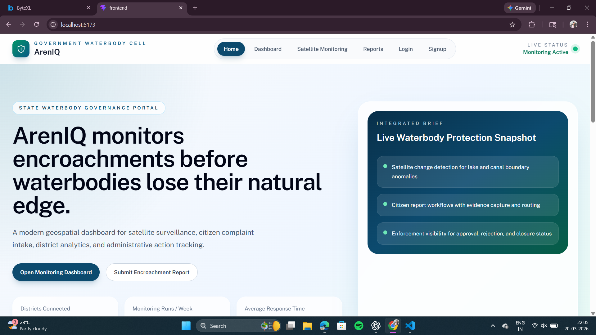
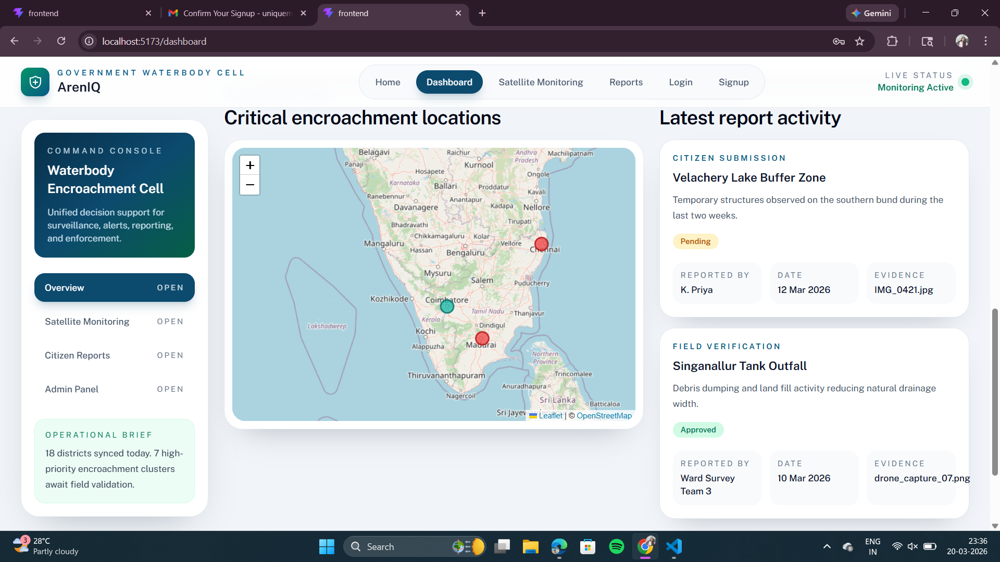
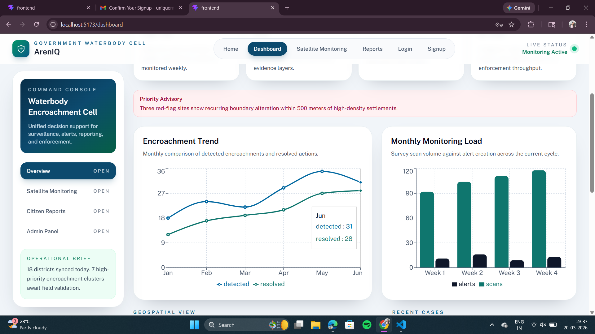
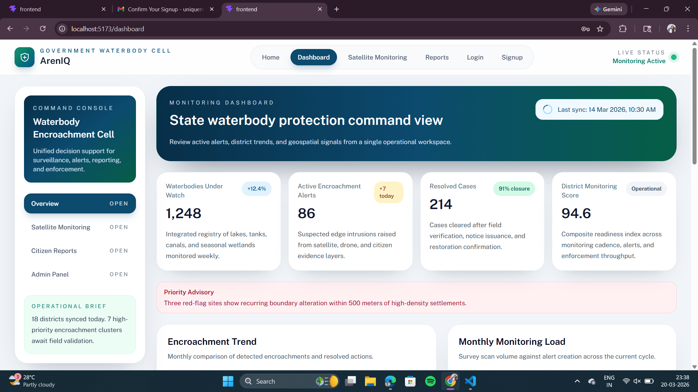
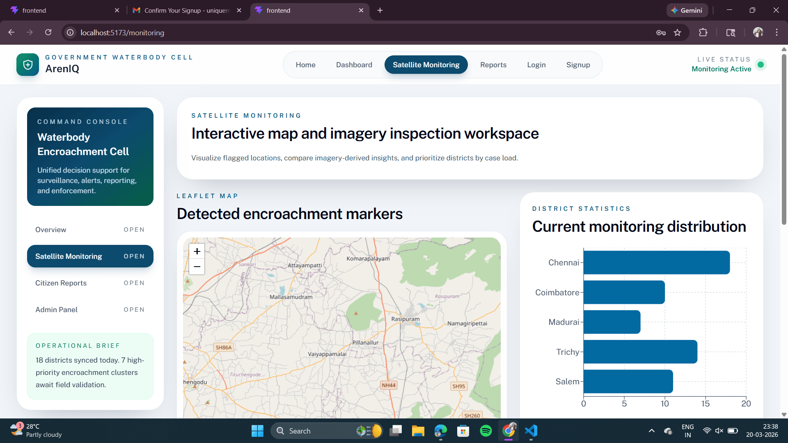
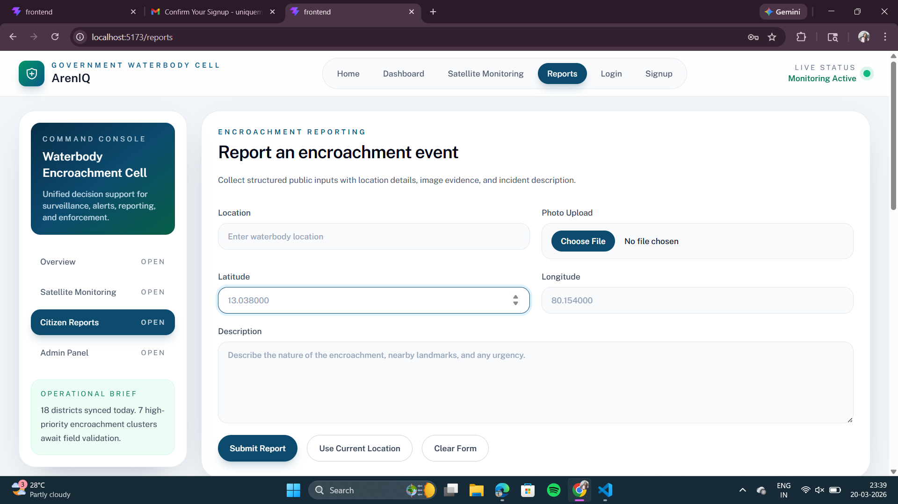
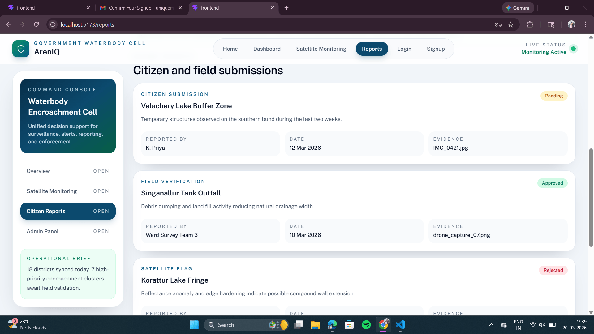
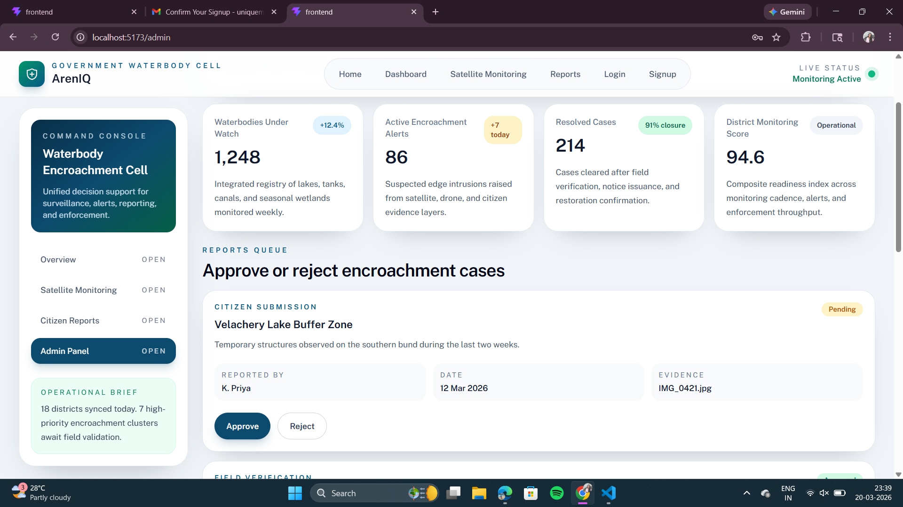

# 📸 ArenIQ Visual System Overview

This document showcases the key user interfaces and system outputs of ArenIQ, demonstrating real-time monitoring, detection, and reporting workflows.

---

## 🏠 1. Landing Page — System Overview

The landing page introduces ArenIQ as a state-level waterbody governance platform designed to monitor, detect, and prevent encroachments in real time.

It highlights the core capabilities of the system:
- Continuous satellite-based monitoring of waterbodies
- Early detection of encroachments using NDWI and change detection
- Integration with administrative dashboards for decision-making
- Seamless transition between monitoring and reporting workflows

The interface is designed to provide a clear and immediate understanding of the platform’s purpose and operational flow.

---

## 📊 2. Dashboard — Map & Recent Updates

This dashboard provides a real-time spatial overview of monitored regions.

Key features:
- Interactive map displaying monitored waterbodies
- Encroachment indicators and location markers
- Recent updates panel showing latest detections and alerts
- Quick navigation to reports and monitoring modules

This view enables authorities to instantly identify high-risk areas and recent activities.

---

## 📈 3. Analytics — Encroachment Trends & Monitoring

The analytics section visualizes system activity and environmental changes over time.

Includes:
- Line graph showing detected vs resolved encroachments
- Monthly monitoring load and scan frequency
- Bar charts representing alerts generated and processed
- Trend analysis to identify patterns in encroachment activity

This helps authorities make data-driven decisions and evaluate response efficiency.

---

## 📋 4. Dashboard Overview — Key Metrics

A quick summary of critical system metrics:

- 🌊 Waterbodies Under Watch
- 🚨 Active Alerts
- ✅ Resolved Cases
- 📍 District Monitoring Score

These indicators provide a high-level snapshot of system performance and regional status.

---

## 🛰️ 5. Satellite Monitoring — Detection Map

This module displays processed satellite imagery with detected encroachments.

Key features:
- Highlighted encroachment zones on map
- Detection markers indicating affected regions
- Horizontal bar graph showing monitoring coverage across districts
- Real-time visualization of NDWI-based detection output

This is the core intelligence layer of ArenIQ.

---

## ⚠️ 6. Citizen Reporting (Current Implementation)

This interface allows users to submit encroachment reports with:
- Image upload
- GPS-based location tagging
- Optional description/caption

⚠️ Note: This module is currently part of the dashboard but will be moved to a dedicated citizen-facing application to maintain role-based separation between public users and authorities.

---

## 📝 7. Reports Management

This section enables structured handling of reported cases.

Each report contains:
- Reporter name
- Date of submission
- Evidence (image)
- Location details
- Assigned authority/designation

This ensures accountability and traceability of every complaint.

---

## 🛠️ 8. Admin Panel — Validation System

The admin interface allows officials to review and validate reports.

Actions include:
- Approving valid encroachment reports
- Rejecting false or irrelevant submissions
- Managing escalation workflows
- Maintaining system integrity through verification

This ensures only credible reports proceed to enforcement.

---

## 🔬 9. NDWI Detection Output — Encroachment Analysis

This image represents the processed satellite output generated by ArenIQ’s detection pipeline.

Process involved:
- NDWI computation from Sentinel-2 imagery
- Change detection between temporal datasets
- Extraction of regions with significant variation
- Classification of encroachment types

Highlighted regions indicate potential encroachments such as:
- Construction activity
- Land filling
- Waste dumping
- Sand mining

This serves as the core analytical proof of the system’s capability.

---

## 🚀 Summary

The above visuals demonstrate ArenIQ as a fully integrated platform combining:

- Satellite-based automated detection
- Real-time dashboards for authorities
- Data-driven analytics and insights
- Structured reporting and validation workflows

Together, these components enable proactive governance and protection of waterbodies at scale.
